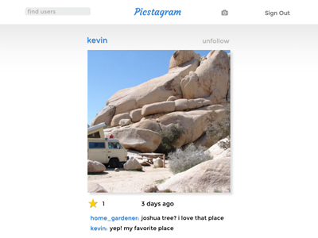

# Picstagram

www.picstagram.us

## An image sharing web app inspired on Instagram.

## App offers users a platform to share, like and comment on images.

- [ ] Front-end built using Javascript and React/Flux.
- [ ] Single-page structure after login allows for immediate update of page based on user interaction.
- [ ] Back-end built with Ruby on Rails, supplying JSON data to the front-end via jbuilder for React's AJAX requests.
- [ ] Implements FLUX structure for RESTful API interaction.
- [ ] Implements follow ability for users to add each other to their personal feeds.
- [ ] Search feature returns a list of persisted users based on the current search data.
- [ ] Implements cloud-based image hosting using cloudinary.com and the Figaro gem.
- [ ] The database persists a portion of each image's url, which is spliced onto a generic url template for view on the app.
- [ ] Implements user Authentication for sign-up/sign-in using BCrypt.
